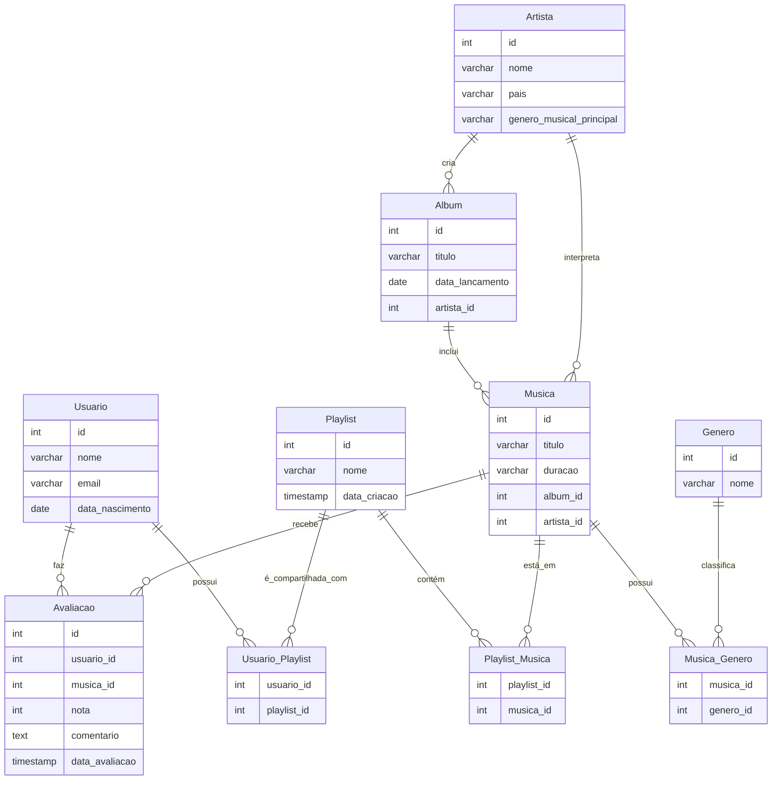

# ProjetoBancoDados2

## Integrantes

Nome: Gabriel Lovato Camilo de Campos - 22.123.004-8

Nome: Theo Zago Zimmermann - 22.123.035-2

## Descrição do Projeto

Este projeto tem como objetivo criar um sistema de música simples estilo spotify para gerenciar essas informações, como Artista, Usuário, Gênero, Álbum, Música, Playlist e Avaliação. O sistema permite o cadastro de dados em um banco de dados PostgreSQL, utilizando a linguagem Python com a biblioteca psycopg2. O projeto também inclui um menu interativo para facilitar a inserção de dados no banco de forma prática.

## Como Executar o Projeto

1.Criar o Banco de Dados

  Como Por Exemplo:
  
    CREATE DATABASE BancoSpotify;

  
2.Criar as tabelas relacionadas a uma universidade

  Depois de criar o banco de dados e conectar-se, deve se inserir as tabelas necessárias e executar o arquivo DDLTables.sql (conforme o GitHub)

3.Configurar o Ambiente que irá executar o código

  Após ter criado as tabelas necessárias, deve-se instalar a biblioteca: pip install psycopg2.

  Deve fazer a conexão com o Banco de Dados, conforme exemplo:

    host = "localhost"
    database = "BancoSpotify"
    user = "postgres"
    password = "sua_senha"
    port = 5432

Após isso, copiar o código do arquivo banco.py e executar(Conforme o GitHub). Rodando o código irá gerar um menu interativo, que por vez, na primeira vez que for inserir os dados, se seguir a numeração do menu, não terá nenhum problema. Após ter feito todas as inserções necessárias, pode inserir conforme quiser.

# Diagrama Modelo Entidade Relacionamento(MER)

## Diagrama Modelo Relacional(MR)

